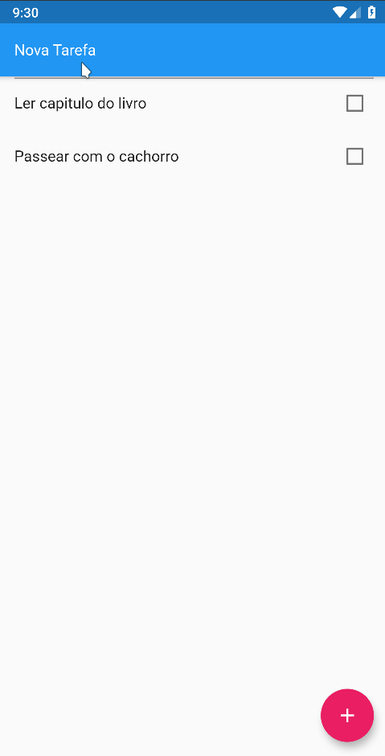

<div align="center" >
  
</div>
<h1 align="center" >
    ToDo List App
</h1>

<h4 align="center">
  Simples aplicativo de listagem de tarefas
</h4>
<div align="center" >
  

</div>

<p align="center">
  <a href="#large_blue_diamond-sobre">Sobre</a>&nbsp;&nbsp;&nbsp;|&nbsp;&nbsp;&nbsp;
  <a href="#large_blue_diamond-conteudo-estudado">Conteúdo estudado</a>&nbsp;&nbsp;&nbsp;|&nbsp;&nbsp;&nbsp;
  <a href="#large_blue_diamond-tecnologias">Tecnologias</a>&nbsp;&nbsp;&nbsp;|&nbsp;&nbsp;&nbsp;
  <a href="#large_blue_diamond-como-utilizar">Como instalar</a>
</p>
<br/>

## :large_blue_diamond: Sobre

Este é um simples ToDo list, onde você pode adicionar uma tarefa à sua lista, marcar como feita e excluí-la.

Este projeto foi desenvolvido no curso: Criando seu primeiro App com Flutter, do [Balta.io](https://balta.io/).
<br/>
<br/>

## :large_blue_diamond: Conteudo estudado

Neste projeto de estudo foram vistos os seguintes conteúdos:

- Instalação do Flutter e principais conceitos
- Stateless e Stateful Widgets
- Gerenciamento de estado no Flutter
- Armazenamento interno com Shared Preferences
  <br/>
  <br/>

## :large_blue_diamond: Tecnologias

Este projeto foi desenvolvido com as seguintes tecnologias

- [Flutter](https://flutter.dev/)
- [Shared Preferences](https://pub.dev/packages/shared_preferences)
- [VS Code][vc]
  <br/>
  <br/>

## :large_blue_diamond: Como utilizar

Para rodar a aplicação você precisa ter o [Git](https://git-scm.com) e [Flutter](https://flutter.dev/) na sua máquina. Você precisará também de um emulador para Android ou IOS.
Como sugestão, utilize o emulador Android do [Android Studio](https://developer.android.com/studio) ou o [Genymotion](https://www.genymotion.com/).

Abra seu emulador e siga os comandos abaixo em seu terminal:

```bash
# Clone this repository
$ git clone https://github.com/agnaldoburgojr/todo-app.git todo

# Go into the repository
$ cd todo

# Run the app
$ flutter run
```

<br/>

## :large_blue_diamond: Licença

Este projeto possui Licença MIT. Olhe [LICENSE](https://github.com/agnaldoburgojr/todo-app/blob/master/LICENCE) para mais informações.

<br/>

---

Feito com ♥ por Agnaldo Burgo Junior :wave: [Get in touch!](https://www.linkedin.com/in/agnaldo-burgo-junior/)

[vc]: https://code.visualstudio.com/
